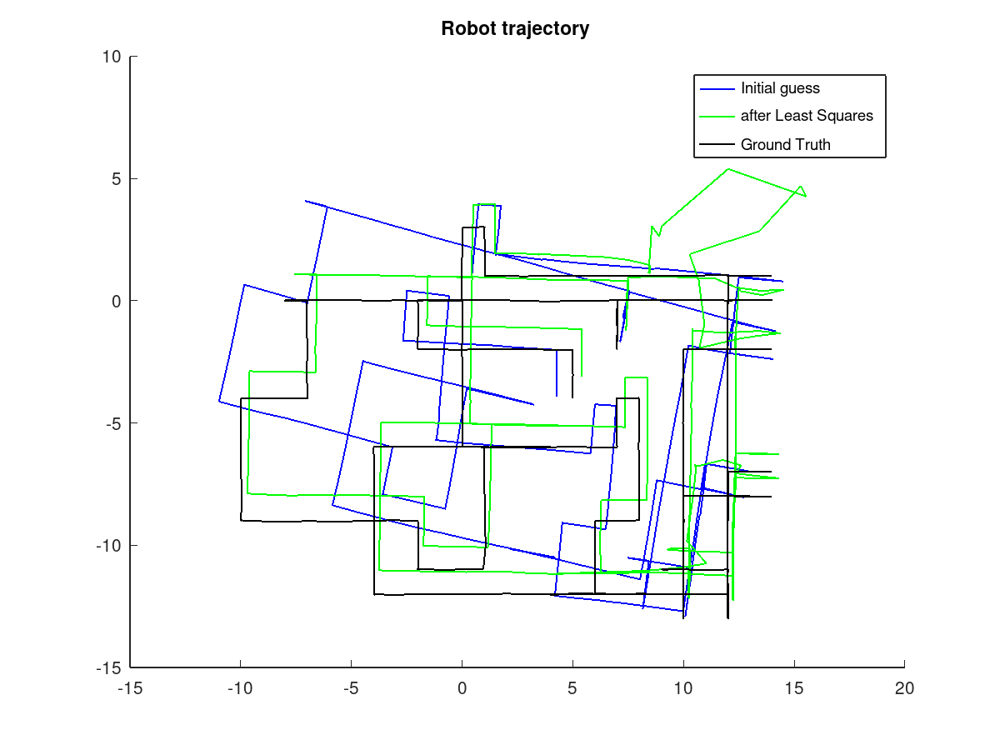

# Probabilistic_Robotics_2021_2022_Project
Project of probabilistic robotics 2021/2022
Range only SLAM

## Goal
Estimating initial map from measurements and reduce error from trajectory and landmarks using least square algorithm

## Results
After Initial Guess:
- landmark error: 3.081
- pose error: 2.469

After 25 iterations:

- Using only range measurements:
     - landmark error: 2.82
     - pose error: 2.56

- Using range and odometry measurements:
     - landmark error: 1.569
     - pose error: 1.6767

Using also the odometry measurements in the least squares algorithm greatly reduce the error, but introduce some artifacts in the upper-right region of the path.

### Results using range and odometry measurements

Notice problems on top-right corner but good accuracy on trajectory

### Results using only range

## Running
Execute by running main.m
